processes commands - 
1. ps 
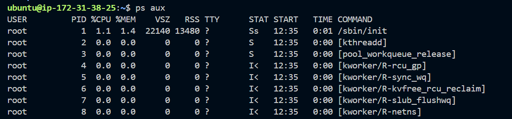
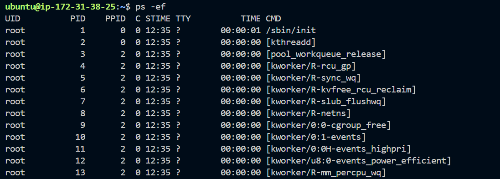

2. top
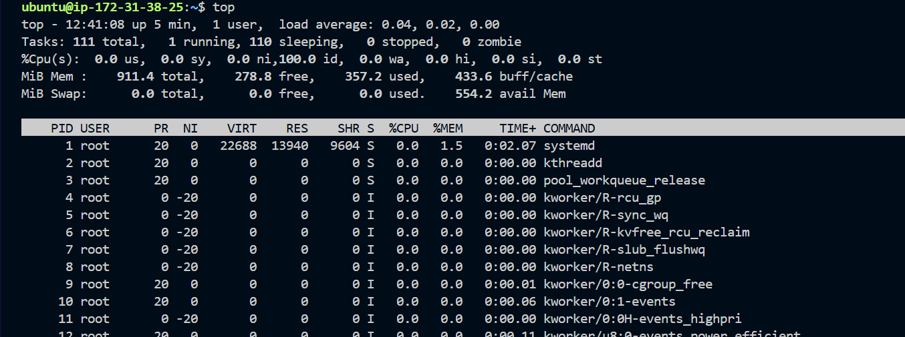

3. htop
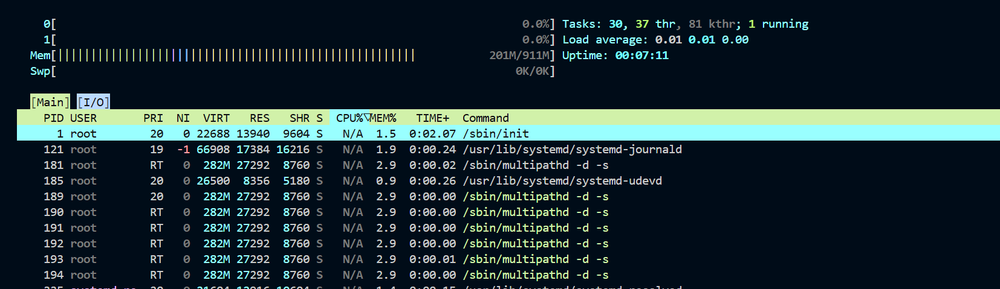

4. pstree
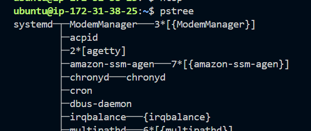

services commands -
1. systemctl list-units
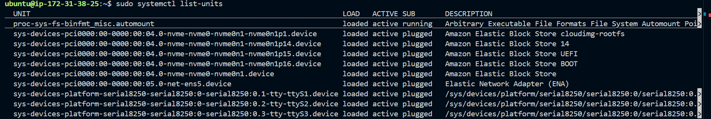

2. sudo systemctl status  nginx
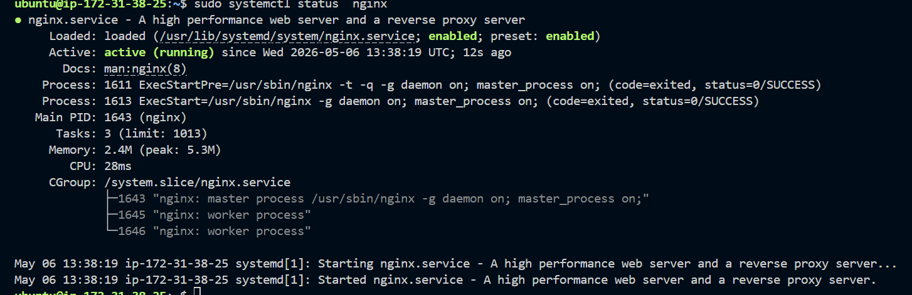

3. sudo systemctl stop nginx 
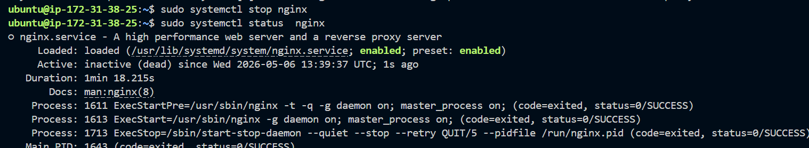

logs command -
1. journalctl -u nginx
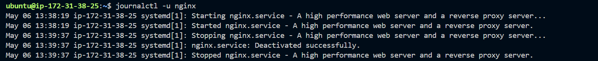

2. journalcctl -xe -> very recent system errors
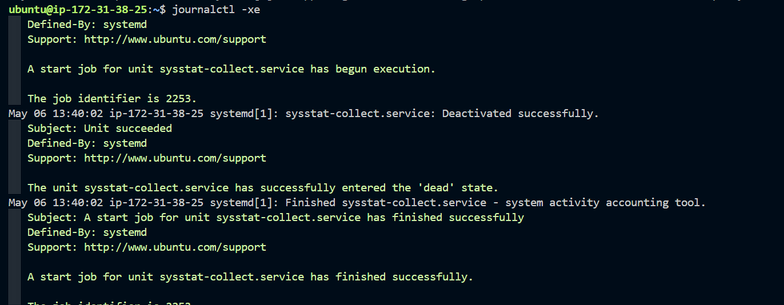

Inspecting a service -
* SSH

1. systemctl status ssh
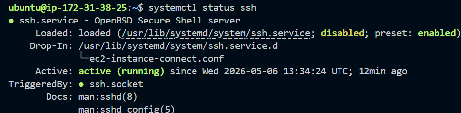

2. systemctl is-enabled nginx
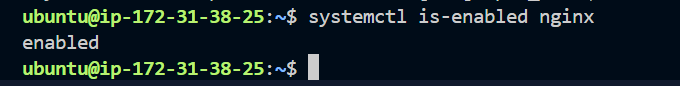

3. journalctl -u ssh -n 20 -> last 20 logs 
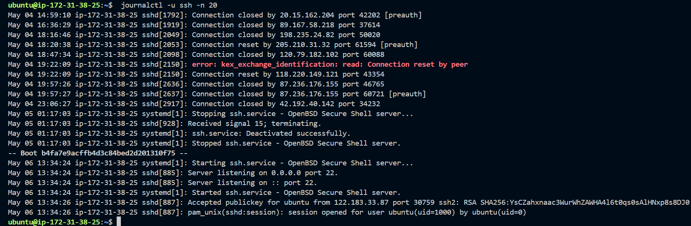

4. live logs while debugging
journalctl -u ssh -f

5. systemctl cat ssh -> shows file loc, start command and dependencies
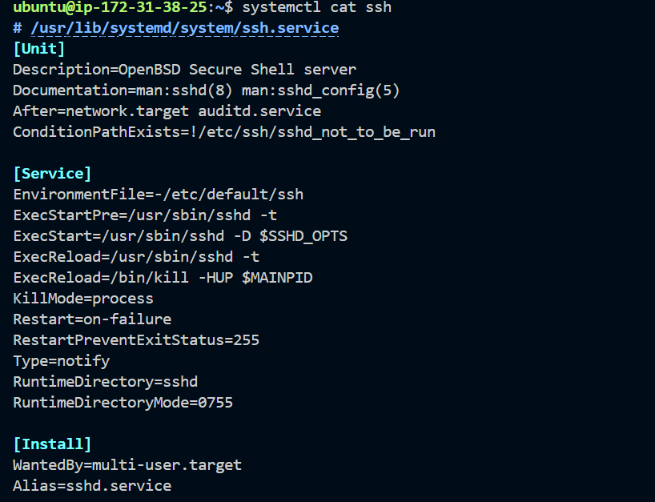