### Task 1: Docker Images
1. Pull the `nginx`, `ubuntu`, and `alpine` images from Docker Hub
2. 2. List all images on your machine — note the sizes
->
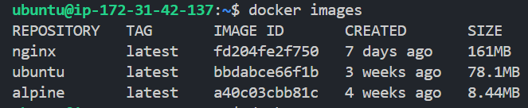

3. Compare `ubuntu` vs `alpine` — why is one much smaller?
-> alpine is smaller

4. Inspect an image — what information can you see?
->
It shows images id, tags, exposed ports, env variables, entrypoint and cmd entry, OS info.

5. Remove an image you no longer need.
-> docker rmi img_id/image_name
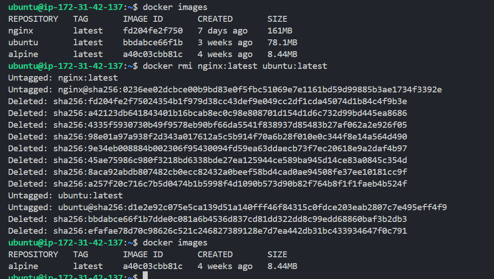

### Task 2: Image Layers
1. Run `docker image history nginx` — what do you see?
-> I can see image ids with their respective commands.

2. Each line is a **layer**. Note how some layers show sizes and some show 0B

3. Write in your notes: What are layers and why does Docker use them?
->
done.

### Task 3: Container Lifecycle
Practice the full lifecycle on one container:
1. **Create** a container (without starting it)
2. **Start** the container
3. **Pause** it and check status
4. **Unpause** it
5. **Stop** it
6. **Restart** it
7. **Kill** it
8. **Remove** it
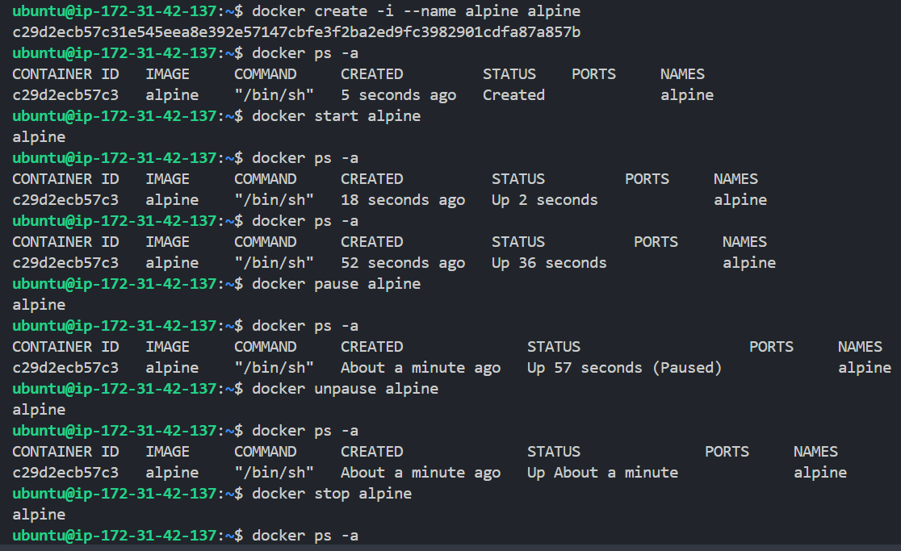
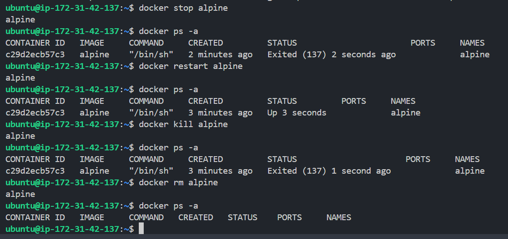

Check `docker ps -a` after each step — observe the state changes.

### Task 4: Working with Running Containers
1. Run an Nginx container in detached mode
2. View its **logs**
3. View **real-time logs** (follow mode)
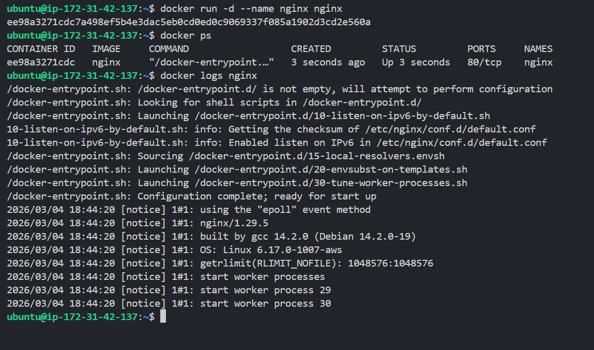

4. **Exec** into the container and look around the filesystem
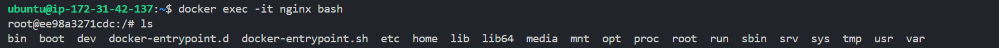
5. Run a single command inside the container without entering it
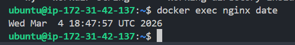

6. **Inspect** the container — find its IP address, port mappings, and mounts
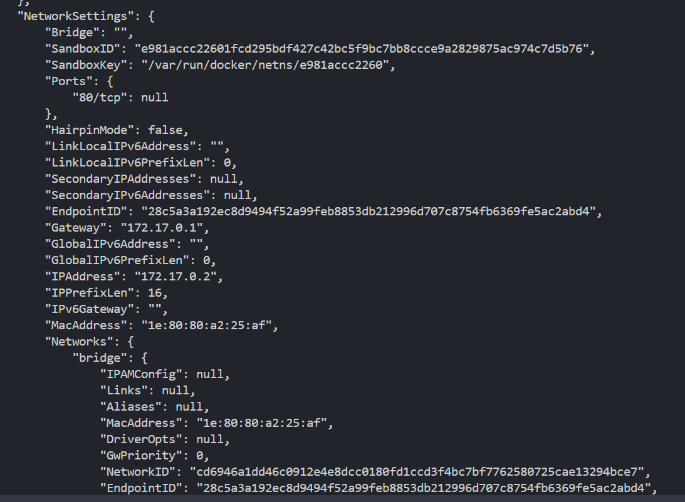
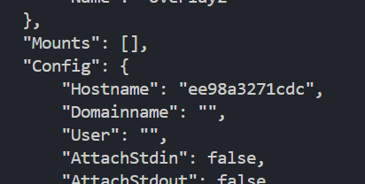
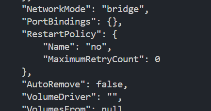
---

### Task 5: Cleanup
1. Stop all running containers in one command
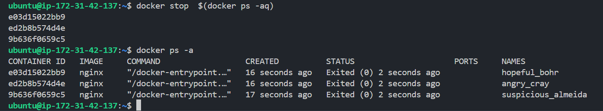

2. Remove all stopped containers in one command
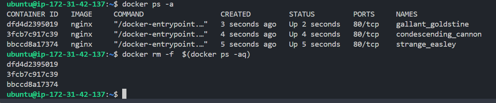

3. Remove unused images
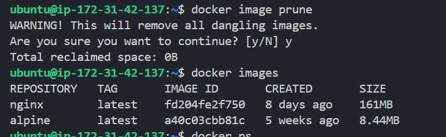

4. Check how much disk space Docker is using
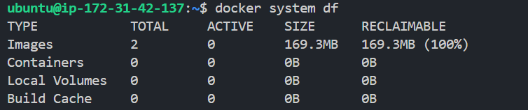