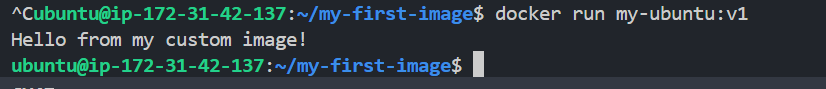
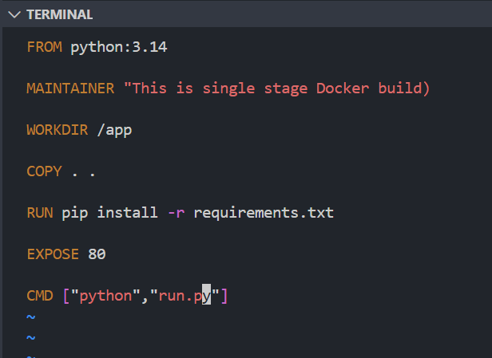
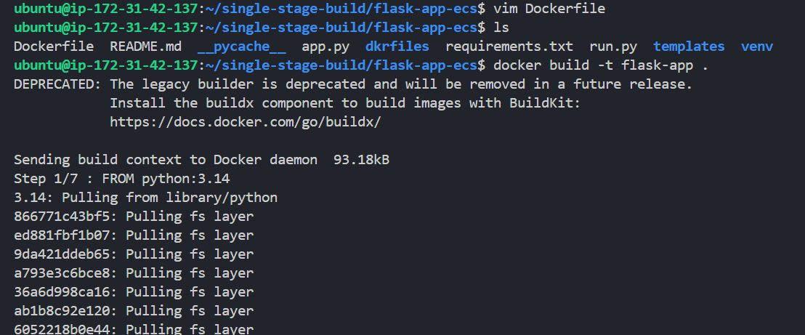
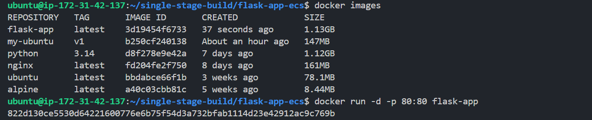
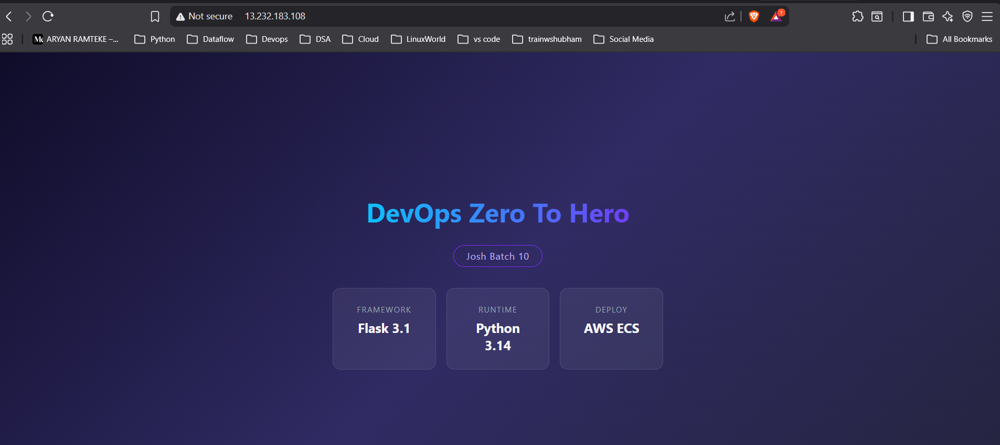
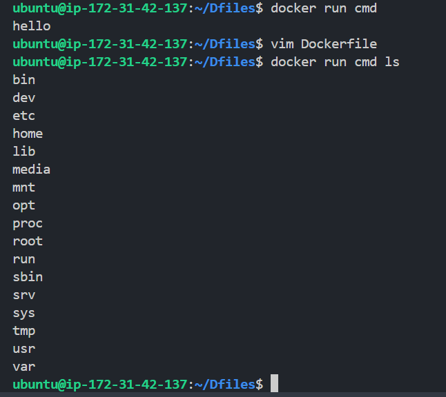
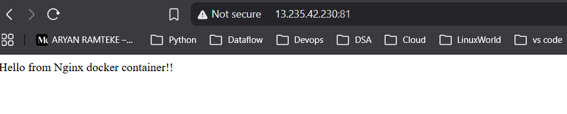
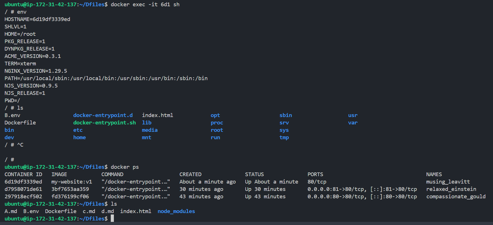

## Challenge Tasks

### Task 1: Your First Dockerfile
1. Create a folder called `my-first-image`
2. Inside it, create a `Dockerfile` that:
   - Uses `ubuntu` as the base image
   - Installs `curl`
   - Sets a default command to print `"Hello from my custom image!"`
3. Build the image and tag it `my-ubuntu:v1`
4. Run a container from your image

**Verify:** The message prints on `docker run`

---

### Task 2: Dockerfile Instructions
Create a new Dockerfile that uses **all** of these instructions:
- `FROM` — base image
- `RUN` — execute commands during build
- `COPY` — copy files from host to image
- `WORKDIR` — set working directory
- `EXPOSE` — document the port
- `CMD` — default command

Build and run it. Understand what each line does.

---

### Task 3: CMD vs ENTRYPOINT
1. Create an image with `CMD ["echo", "hello"]` — run it, then run it with a custom command. What happens?

The command written inside CMD is overriden.

2. Create an image with `ENTRYPOINT ["echo"]` — run it, then run it with additional arguments. What happens?
- Extra arguments are passed as args to command in the entrypoint.

3. Write in your notes: When would you use CMD vs ENTRYPOINT?
- When you want to override any commands while running containers then use CMD . When you want that main executable shouldn't be overrriden then use Entrypoint. 

---

### Task 4: Build a Simple Web App Image
1. Create a small static HTML file (`index.html`) with any content
2. Write a Dockerfile that:
   - Uses `nginx:alpine` as base
   - Copies your `index.html` to the Nginx web directory
-> # grep -r "Welcome to nginx!" /
3. Build and tag it `my-website:v1`
4. Run it with port mapping and access it in your browser
->
1. For multiple containers, failed to map with same ports.
2. changes port to 81, but failed to access the webpage as the inbound rules was not present for port 81 for the security group.

---

### Task 5: .dockerignore
1. Create a `.dockerignore` file in one of your project folders
2. Add entries for: `node_modules`, `.git`, `*.md`, `.env`
3. Build the image — verify that ignored files are not included

---

### Task 6: Build Optimization
1. Build an image, then change one line and rebuild — notice how Docker uses **cache**
2. Reorder your Dockerfile so that frequently changing lines come **last**
3. Write in your notes: Why does layer order matter for build speed?
-> beacuse docker caches layer and reuses those if unchanged. Docker completely ignores the unchanged layer and skips the build. Also if we do any changes in suppose line 4 then, docker starts building from line 4 onwards only.   

---