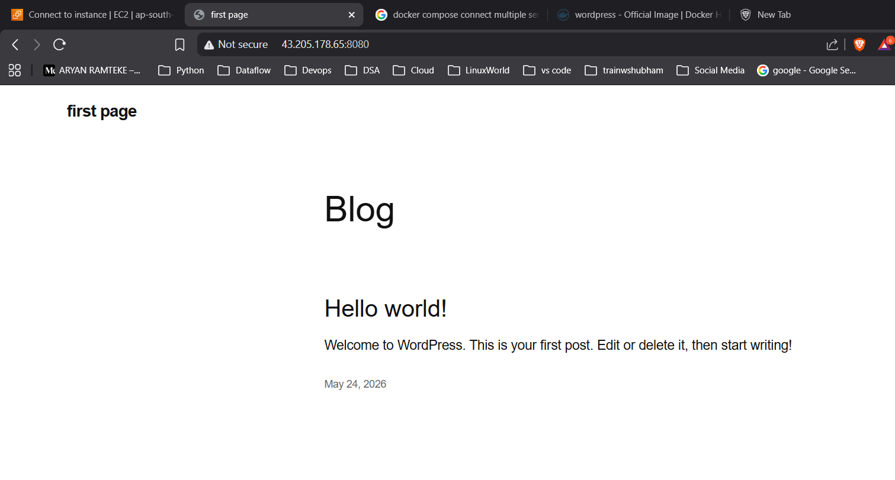
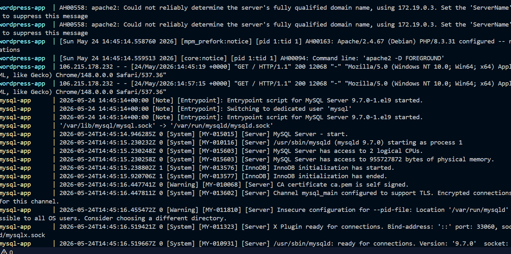
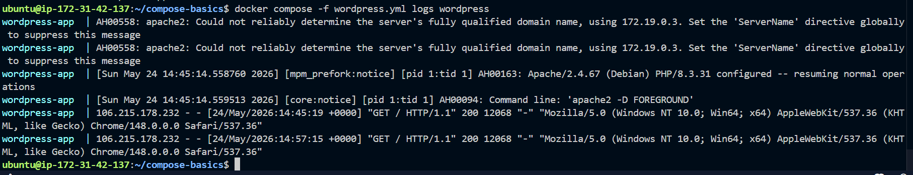
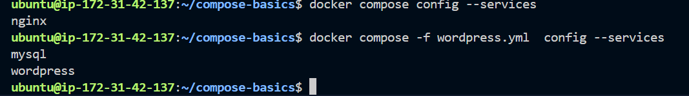
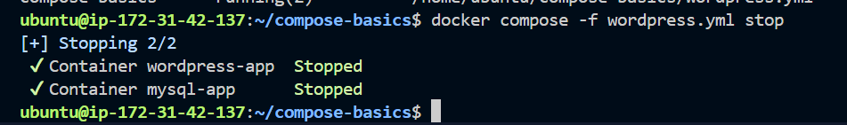
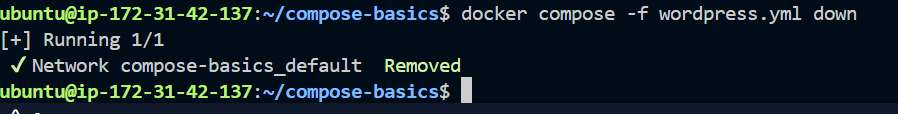
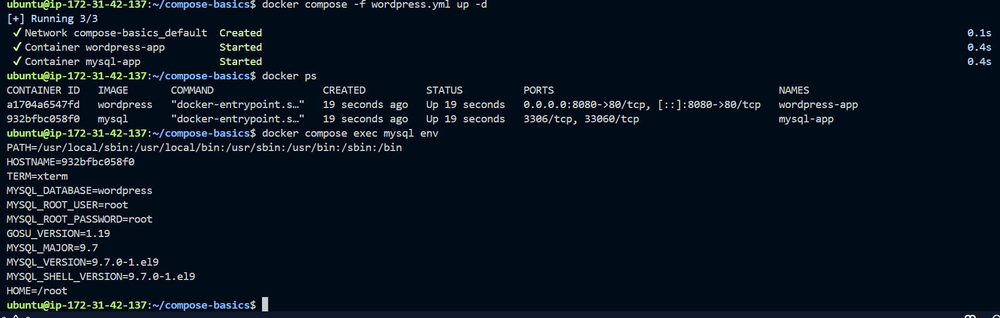
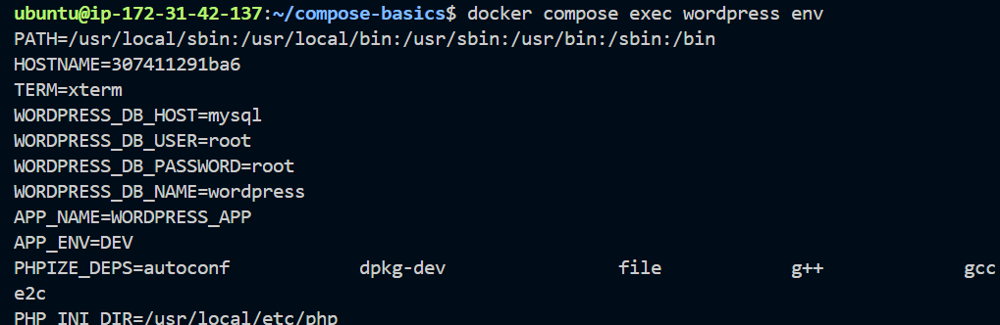
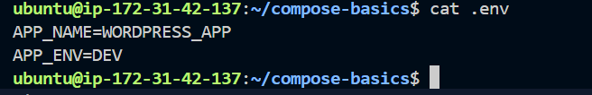

## Challenge Tasks

### Task 1: Install & Verify
1. Check if Docker Compose is available on your machine
2. Verify the version

---

### Task 2: Your First Compose File
1. Create a folder `compose-basics`
2. Write a `docker-compose.yml` that runs a single **Nginx** container with port mapping
3. Start it with `docker compose up`
4. Access it in your browser
5. Stop it with `docker compose down`

---

### Task 3: Two-Container Setup
Write a `docker-compose.yml` that runs:
- A **WordPress** container
- A **MySQL** container

They should:
- Be on the same network (Compose does this automatically)
- MySQL should have a named volume for data persistence
- WordPress should connect to MySQL using the service name

Start it, access WordPress in your browser, and set it up.

**Verify:** Stop and restart with `docker compose down` and `docker compose up` — is your WordPress data still there?
yes

---

### Task 4: Compose Commands
Practice and document these:
1. Start services in **detached mode**
-> docker compose -f wordpress.yml up -d
2. View running services
-> docker compose ps
3. View **logs** of all services

-> docker compose -f wordpress.yml  logs
4. View logs of a **specific** service

->  docker compose -f wordpress.yml  logs wordpress

5. **Stop** services without removing

6. **Remove** everything (containers, networks)

7. **Rebuild** images if you make a change
-> docker compose up -d --build 

---

### Task 5: Environment Variables
1. Add environment variables directly in your `docker-compose.yml`

2. Create a `.env` file and reference variables from it in your compose file
3. Verify the variables are being picked up

---

## Hints
- Start: `docker compose up -d`
- Stop: `docker compose down`
- Logs: `docker compose logs -f`
- Compose creates a default network for all services automatically
- Service names in compose are the DNS names containers use to talk to each other
