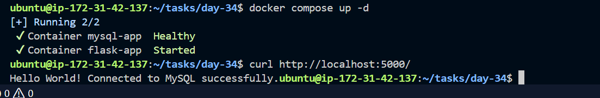
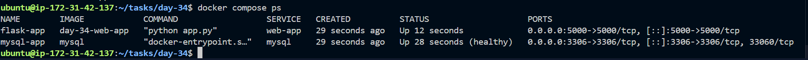
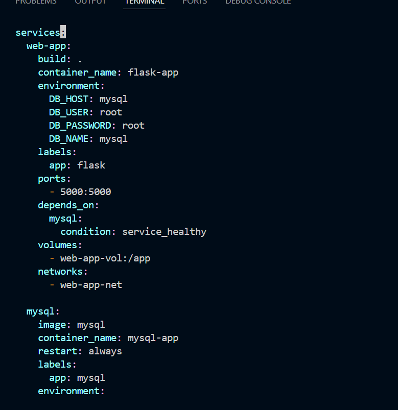
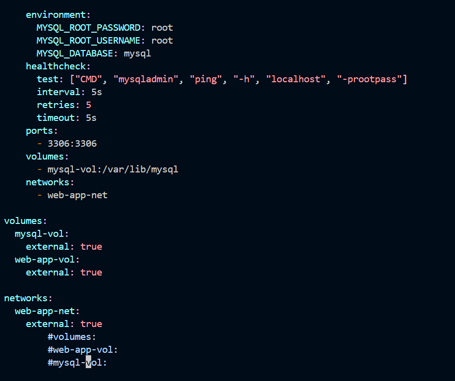

## Challenge Tasks

### Task 1: Build Your Own App Stack
Create a `docker-compose.yml` for a 3-service stack:
- A **web app** (use Python Flask, Node.js, or any language you know)
- A **database** (Postgres or MySQL)
- A **cache** (Redis)

Write a simple Dockerfile for the web app. The app doesn't need to be complex — even a "Hello World" that connects to the database is enough.

---

### Task 2: depends_on & Healthchecks
1. Add `depends_on` to your compose file so the app starts **after** the database
2. Add a **healthcheck** on the database service
3. Use `depends_on` with `condition: service_healthy` so the app waits for the database to be truly ready, not just started

**Test:** Bring everything down and up — does the app wait for the DB?
yes

---

### Task 3: Restart Policies
1. Add `restart: always` to your database service
2. Manually kill the database container — does it come back?
-> No
3. Try `restart: on-failure` — how is it different?

4. Write in your notes: When would you use each restart policy?

---

### Task 4: Custom Dockerfiles in Compose
1. Instead of using a pre-built image for your app, use `build:` in your compose file to build from a Dockerfile
2. Make a code change in your app
3. Rebuild and restart with one command
-> done
---

### Task 5: Named Networks & Volumes
1. Define **explicit networks** in your compose file instead of relying on the default
2. Define **named volumes** for database data
3. Add **labels** to your services for better organization
-done

---

### Task 6: Scaling (Bonus)
1. Try scaling your web app to 3 replicas using `docker compose up --scale`
2. What happens? What breaks?
- if container name is hardcoded then it doest scale
- Only one container can use host port 5000. When scaling replicas, additional containers fail because the host port is already occupied.

Container ports are isolated internally, but host ports are shared system-wide.

3. Write in your notes: Why doesn't simple scaling work with port mapping?

