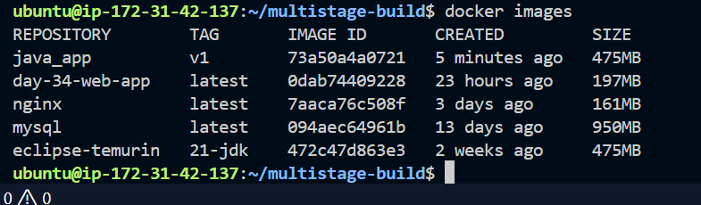
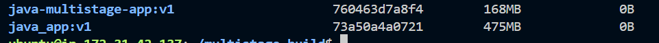
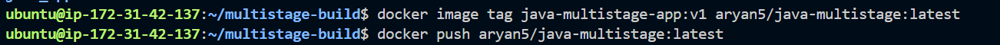
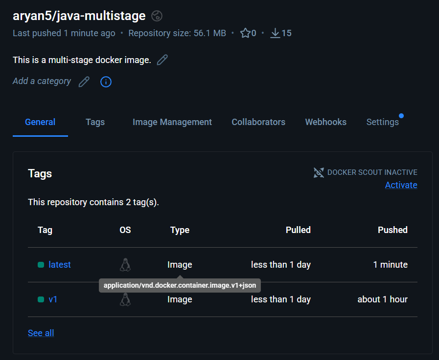
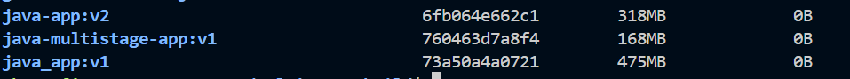
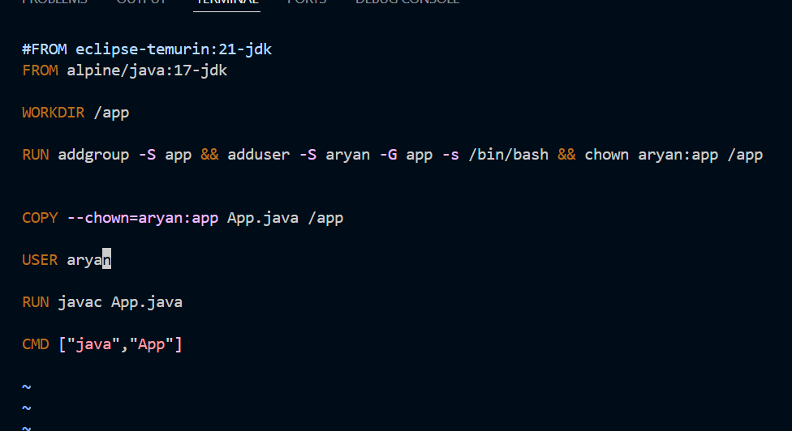

## Challenge Tasks

### Task 1: The Problem with Large Images
1. Write a simple Go, Java, or Node.js app (even a "Hello World" is fine)
2. Create a Dockerfile that builds and runs it in a **single stage**
3. Build the image and check its **size**

Note down the size — you'll compare it later.
-> 475Mb
---

### Task 2: Multi-Stage Build
1. Rewrite the Dockerfile using **multi-stage build**:
   - Stage 1: Build the app (install dependencies, compile)
   - Stage 2: Copy only the built artifact into a minimal base image (`alpine`, `distroless`, or `scratch`)
2. Build the image and check its size again
3. Compare the two sizes

Write in your notes: Why is the multi-stage image so much smaller?
-> Because in the first stage we used base image to just compile the java code and then this compiled code is used in the second stage deployer which used distroless image having less size containing only app code and the runtime. 
---

### Task 3: Push to Docker Hub
1. Create a free account on [Docker Hub](https://hub.docker.com) (if you don't have one)
2. Log in from your terminal
3. Tag your image properly: `yourusername/image-name:tag`

4. Push it to Docker Hub
5. Pull it on a different machine (or after removing locally) to verify

---

### Task 4: Docker Hub Repository
1. Go to Docker Hub and check your pushed image

2. Add a **description** to the                         
3. Explore the **tags** tab — understand how versioning works

4. Pull a specific tag vs `latest` — what happens?

---

### Task 5: Image Best Practices
Apply these to one of your images and rebuild:
1. Use a **minimal base image** (alpine vs ubuntu — compare sizes)
2. **Don't run as root** — add a non-root USER in your Dockerfile
3. Combine `RUN` commands to **reduce layers**
4. Use **specific tags** for base images (not `latest`)

Check the size before and after.

---