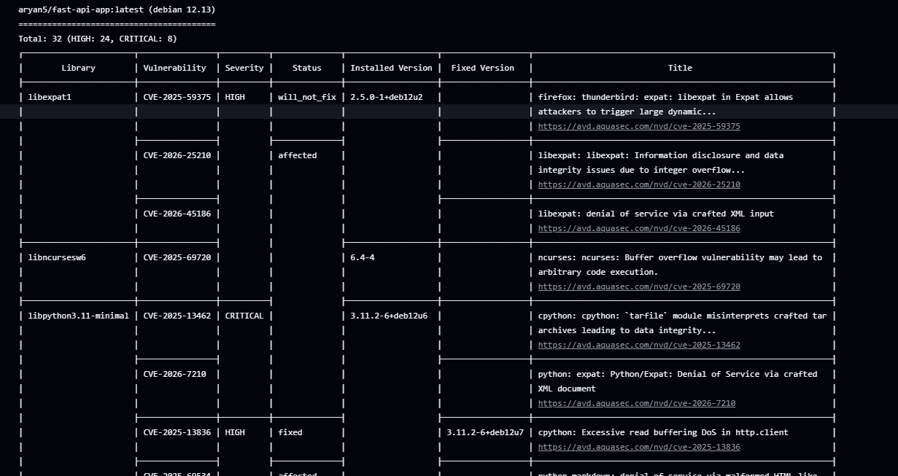
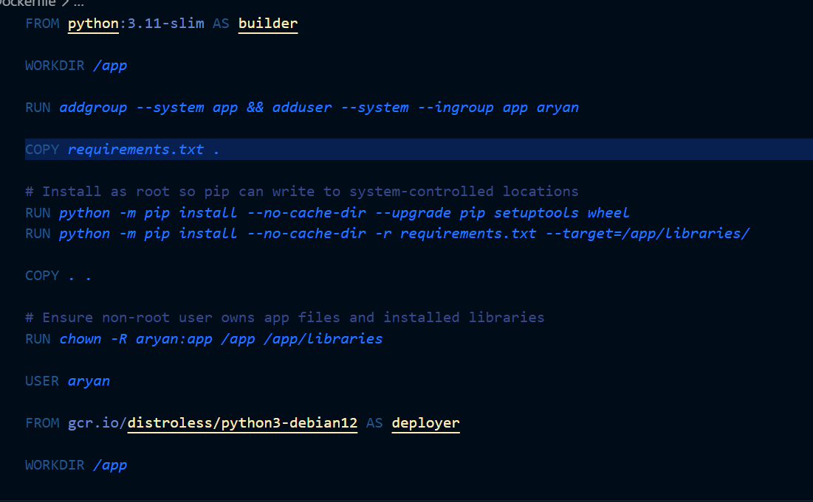
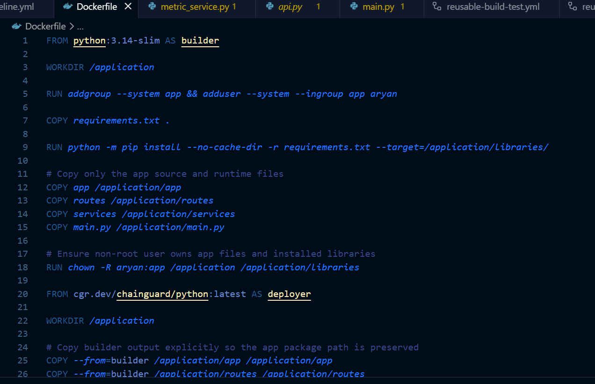
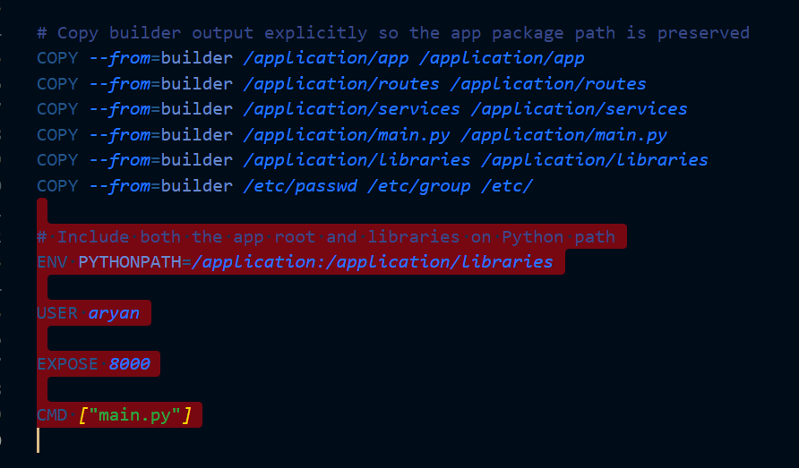
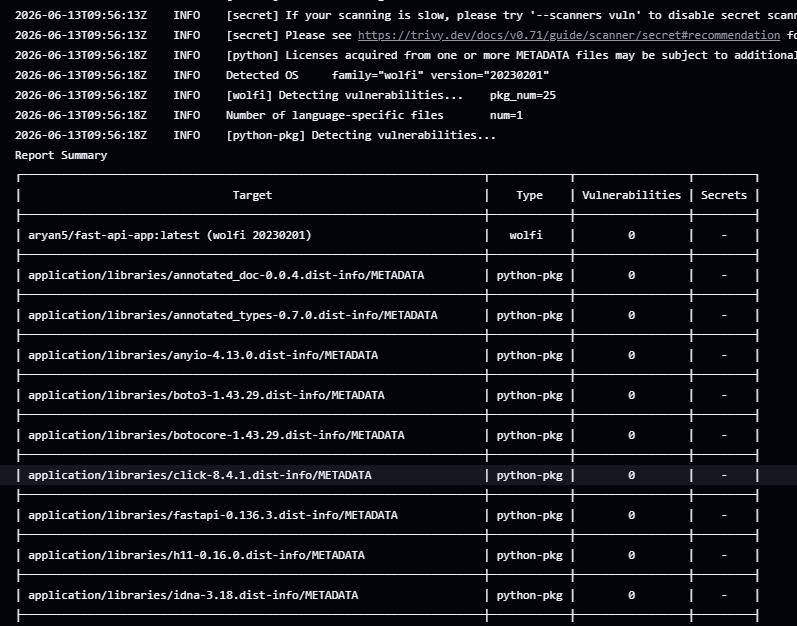
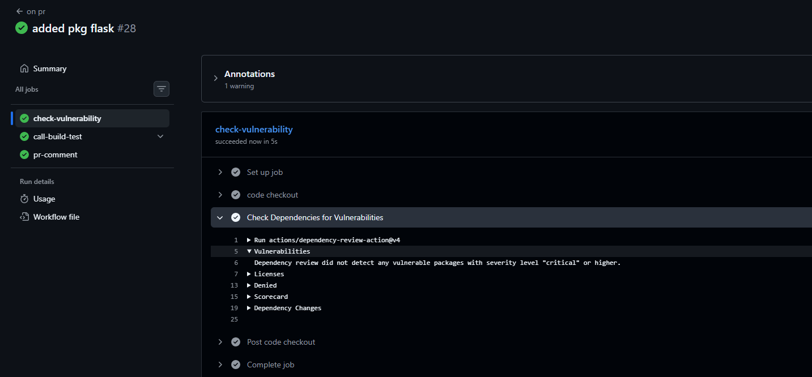
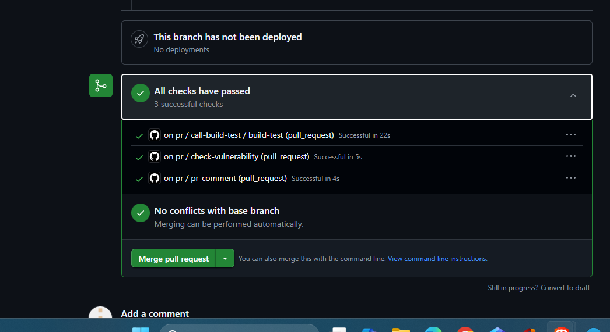

## Challenge Tasks

### Task 1: Scan Your Docker Image for Vulnerabilities
Your Docker image might use a base image with known security issues. Let's find out.

Add this step to your main branch pipeline (after Docker build, before deploy):
```yaml
- name: Scan Docker Image for Vulnerabilities
  uses: aquasecurity/trivy-action@master
  with:
    image-ref: 'your-username/your-app:latest'
    format: 'table'
    exit-code: '1'
    severity: 'CRITICAL,HIGH'
```

What this does:
- `trivy` scans your Docker image for known CVEs (Common Vulnerabilities and Exposures)
- `format: 'table'` prints a readable table in the logs
- `exit-code: '1'` means **fail the pipeline** if CRITICAL or HIGH vulnerabilities are found
- If it passes, your image is clean — proceed to push and deploy

Push and check the Actions tab. Read the scan output.

**Verify:** Can you see the vulnerability table in the logs? Did it pass or fail?
It got failed.



Used cgr.dev/chainguard/python:latest that contains almost no vulnerabilities.





Write in your notes: What CVEs (if any) were found? What base image are you using?
---

### Task 2: Enable GitHub's Built-in Secret Scanning
GitHub can automatically detect if someone pushes a secret (API key, token, password) to your repo.

1. Go to your repo → Settings → **Code security and analysis**
2. Enable **Secret scanning**
3. If available, also enable **Push protection** — this blocks the push entirely if a secret is detected

That's it — no workflow changes needed. GitHub does this automatically.

Write in your notes:
- What is the difference between secret scanning and push protection?
-> Secret Scanning detects secrets that have already been committed and alerts the repository owners. Push Protection is proactive and prevents secrets from being pushed in the first place. If GitHub detects a leaked AWS access key, it generates a security alert, may notify AWS, and the exposed key should be revoked and rotated immediately.

- What happens if GitHub detects a leaked AWS key in your repo?
-> GitHub identifies the AWS credential pattern.
A security alert is created in the repository's Security tab.
Repository administrators and security teams can be notified.
In many cases, GitHub may notify AWS about the exposed credential.
The AWS key should be immediately:
Revoked/disabled
Rotated (generate a new key)
Removed from the repository history if necessary
If Push Protection is enabled, the push may be blocked before the secret reaches the repository.
---

### Task 3: Scan Dependencies for Known Vulnerabilities
If your app uses packages (pip, npm, etc.), those packages might have known vulnerabilities.

Add this to your **PR pipeline** (not the main pipeline):
```yaml
- name: Check Dependencies for Vulnerabilities
  uses: actions/dependency-review-action@v4
  with:
    fail-on-severity: critical
```

This checks any **new** dependencies added in the PR against a vulnerability database. If a dependency has a critical CVE, the PR check fails.

Test it:
1. Open a PR that adds a package to your app
2. Check the Actions tab — did the dependency review run?

**Verify:** Does the dependency review show up as a check on your PR?

---

### Task 4: Add Permissions to Your Workflows
By default, workflows get broad permissions. Lock them down.

Add this block near the top of your workflow files (after `on:`):
```yaml
permissions:
  contents: read
```

If a workflow needs to comment on PRs, add:
```yaml
permissions:
  contents: read
  pull-requests: write
```

Update at least 2 of your existing workflow files with a `permissions` block.

Write in your notes: Why is it a good practice to limit workflow permissions? What could go wrong if a compromised action has write access to your repo?
-> Limiting workflow permissions follows the principle of least privilege. It reduces the attack surface by granting only the permissions required for a workflow. If a compromised or malicious action has write access to the repository, it could modify source code, push unauthorized commits, alter workflow files, create releases, or establish persistent access, potentially compromising the entire software supply chain.
---

### Task 5: See the Full Secure Pipeline
Look at what your pipeline does now:

```
PR opened
  → build & test
  → dependency vulnerability check     ← NEW (Day 49)
  → PR checks pass or fail

Merge to main
  → build & test
  → Docker build
  → Trivy image scan (fail on CRITICAL) ← NEW (Day 49)
  → Docker push (only if scan passes)
  → deploy

Always active
  → GitHub secret scanning              ← NEW (Day 49)
  → push protection for secrets         ← NEW (Day 49)
```

Draw this diagram in your notes. You just built a **DevSecOps pipeline** — security is now part of your automation, not an afterthought.

---

## Brownie Points (Optional — For the Curious)

### Pin Actions to Commit SHAs
Tags like `@v4` can be moved by the action author. For extra security, pin to the exact commit:
```yaml
# Instead of this:
uses: actions/checkout@v4

# Use this:
uses: actions/checkout@b4ffde65f46336ab88eb53be808477a3936bae11 # v4.1.1
```
This protects against supply chain attacks where a tag is silently changed.

### Upload Scan Results to GitHub Security Tab
Add SARIF output to Trivy and upload it — your scan results will appear in the repo's **Security** tab:
```yaml
- uses: aquasecurity/trivy-action@master
  with:
    image-ref: 'your-username/your-app:latest'
    format: 'sarif'
    output: 'trivy-results.sarif'
- uses: github/codeql-action/upload-sarif@v3
  with:
    sarif_file: 'trivy-results.sarif'
```

### Learn About OIDC (Keyless Authentication)
Instead of storing cloud credentials as long-lived secrets, GitHub Actions can use OIDC to get short-lived tokens automatically. Research: "GitHub Actions OIDC" — it's how production pipelines authenticate to AWS, GCP, and Azure without storing any keys.
